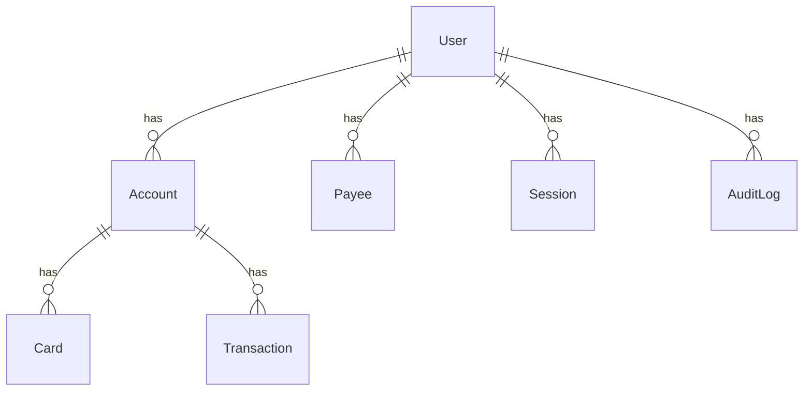
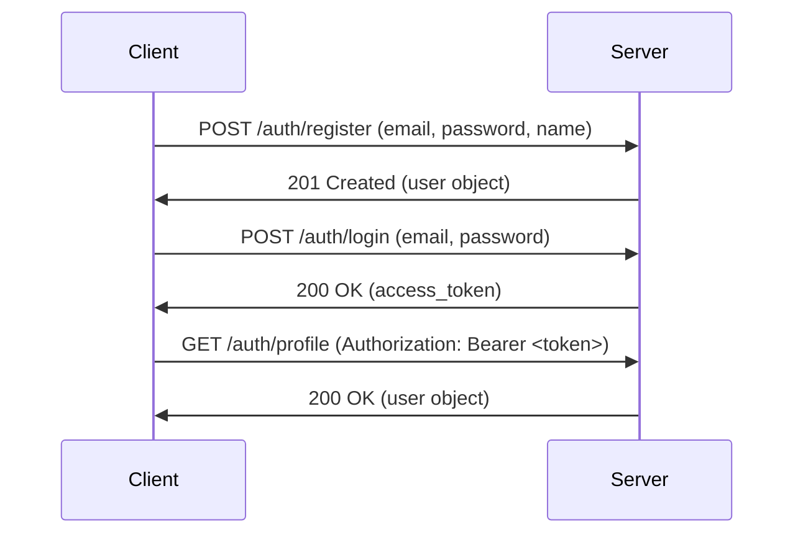

# BankApp

BankApp is a modern web-based banking application for individual users. This project is an MVP (Minimum Viable Product) that includes features like registration, login (with 2FA), account overview, transaction history, and transfers.

## Architecture

The project is a monorepo with two applications:

-   `apps/api`: A NestJS backend that provides a REST API for the banking application.
-   `apps/web`: A React frontend that consumes the API.

The project uses a PostgreSQL database and is containerized with Docker.

## Security

The application implements several security measures:

-   **Password Hashing**: Passwords are hashed with Argon2id.
-   **JWT**: The application uses JSON Web Tokens for authentication.
-   **2FA**: The application will support 2FA with TOTP.
-   **Rate Limiting**: The API will have rate limiting to prevent brute-force attacks.
-   **Input Validation**: The API uses Zod to validate all incoming data.
-   **Helmet**: The API uses Helmet to set various security-related HTTP headers.
-   **CORS**: The API has CORS enabled to prevent cross-origin attacks.

## Getting Started

### Prerequisites

-   Docker
-   Node.js
-   npm

### Running with Docker

1.  Clone the repository.
2.  Run `sudo docker compose up -d`.
3.  The frontend will be available at `http://localhost:5173`.
4.  The backend will be available at `http://localhost:3000`.

### Running Locally

1.  Clone the repository.
2.  Start the database: `sudo docker compose up -d db`.
3.  Install the backend dependencies: `cd apps/api && npm install`.
4.  Run the backend: `npm run start:dev`.
5.  Install the frontend dependencies: `cd apps/web && npm install`.
6.  Run the frontend: `npm run dev`.

## Entity Relationship Diagram (ERD)

## Authentication Flow

